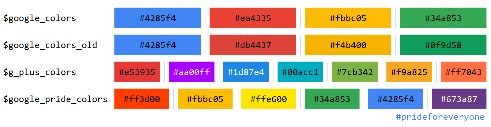

# Material Circular Loader
Google Material design: [Progress & activity](https://www.google.com/design/spec/components/progress-activity.html)

## Usage
HTML
```html
<div class="circular-loader">
  <div class="stroke">
    <div class="stroke-left"></div>
    <div class="stroke-right"></div>
  </div>
</div> 
```
SCSS
```scss
.circular-loader {
  @include loader_circle(stroke); // class name of stroke
}
```

## Size
Width and height are `2em`. (radius of circle is `1em`)  
Use `font-size` to change the loader size.

SCSS
```scss
.circular-loader {
  @include loader_circle(stroke);
  font-size: 30px; // width and height become 60px
}
```

## Single Color
Use `color` to change the loader color.

SCSS
```scss
.circular-loader {
  @include loader_circle(stroke);
  color: #2a74f6;
}
```

## Multiple Colors
Include mixin `loader_stroke_colors` to change the loader color.

HTML
```html
<div class="Cir my-color"> <!-- add a class -->
  <div class="S">
    <div class="S-left"></div>
    <div class="S-right"></div>
  </div>
</div> 
```
SCSS
```scss
.Cir {
  @include loader_circle(S);
  @include loader_stroke_colors(
    S,
    my-color,
    (#4285f4, #ea4335, #fbbc05, #34a853)
  );
  // (classNameOfStroke, addedClassName, listOfColors)
}
```
There are some lists of colors can be used:

| List of colors         | Description           | Colors                   |
| ---------------------- | --------------------- | ------------------------ |
| `$google_colors`       | Google main colors    | Blue, Red, Yellow, Green |
| `$google_colors_old`   | (Old version)         |                          |
| `$g_plus_colors`       | Colors in Google+ app | 7 colors                 |
| `$google_pride_colors` | #prideforeveryone     | 6 colors                 |



## Stroke Width
Stroke width defaults to `(3/14) * 1em`.  
Include mixin `loader_stroke_width` to change the stroke width.

HTML
```html
<div class="Cir new_width"> <!-- add a class -->
  <div class="S">
    <div class="S-left"></div>
    <div class="S-right"></div>
  </div>
</div> 
```
SCSS
```scss
.Cir {
  @include loader_circle(S);
  @include loader_stroke_width(S, new_width, 10px);
  // (classNameOfStroke, addedClassName, widthOfStroke)
}
```

## Rotate Step
Rotate step defaults to `3 / 5`. (a 5 pointed star shape)  
Include mixin `loader_stroke_rotate_step` to change the rotate step.

HTML
```html
<div class="Cir seven_star"> <!-- add a class -->
  <div class="S">
    <div class="S-left"></div>
    <div class="S-right"></div>
  </div>
</div> 
```
SCSS
```scss
.Cir {
  @include loader_circle(S);
  @include loader_stroke_rotate_step(seven_star, 3/7);
  // (addedClassName, step)
}
```